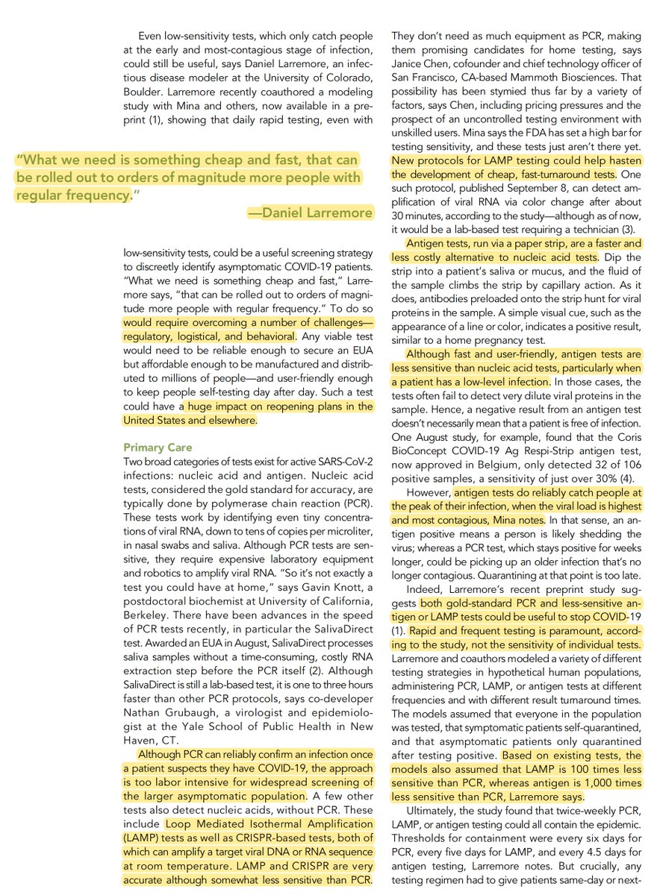
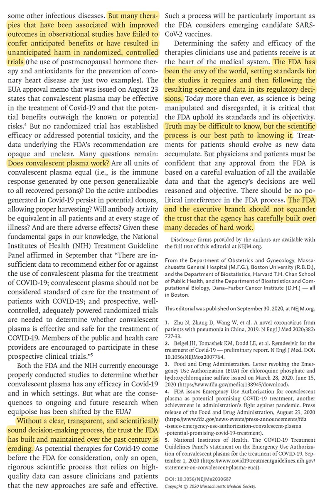
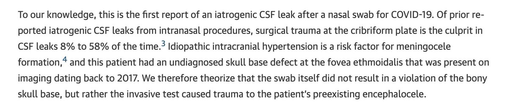
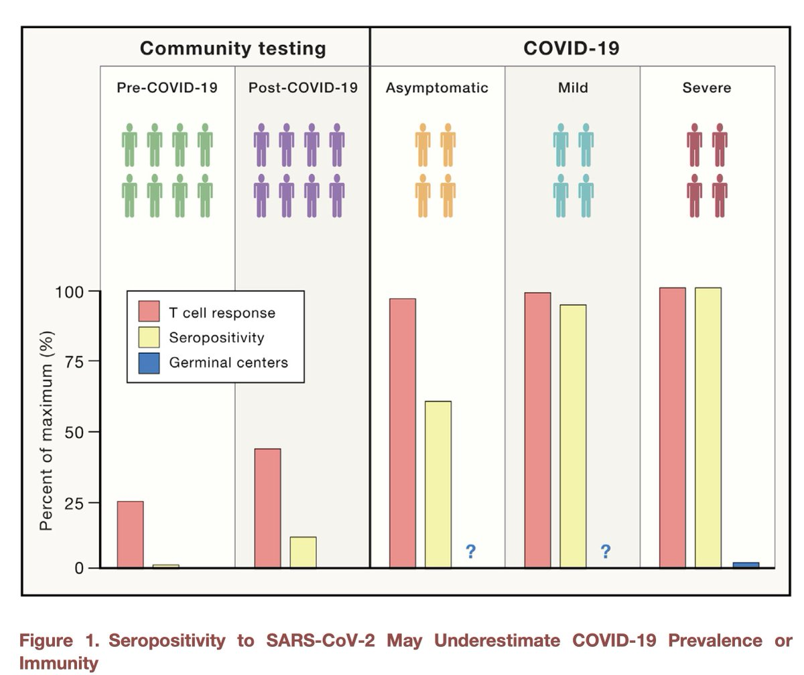
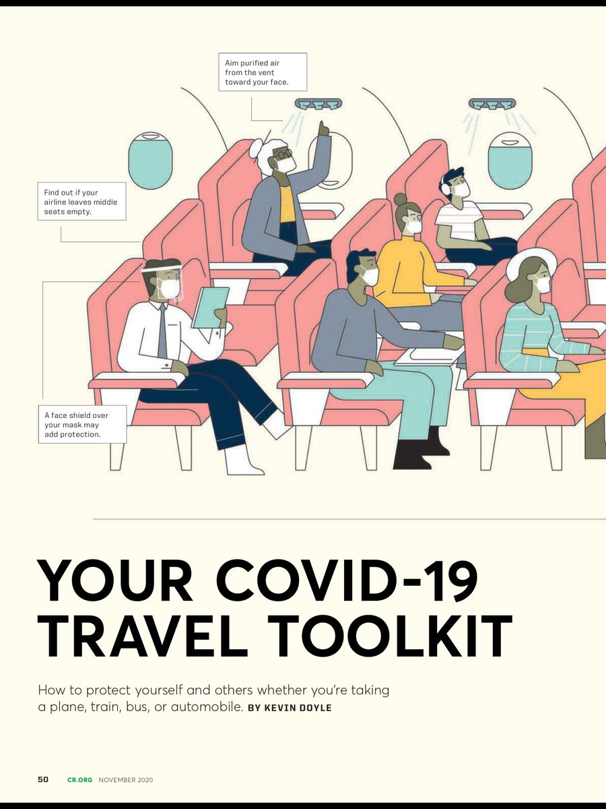
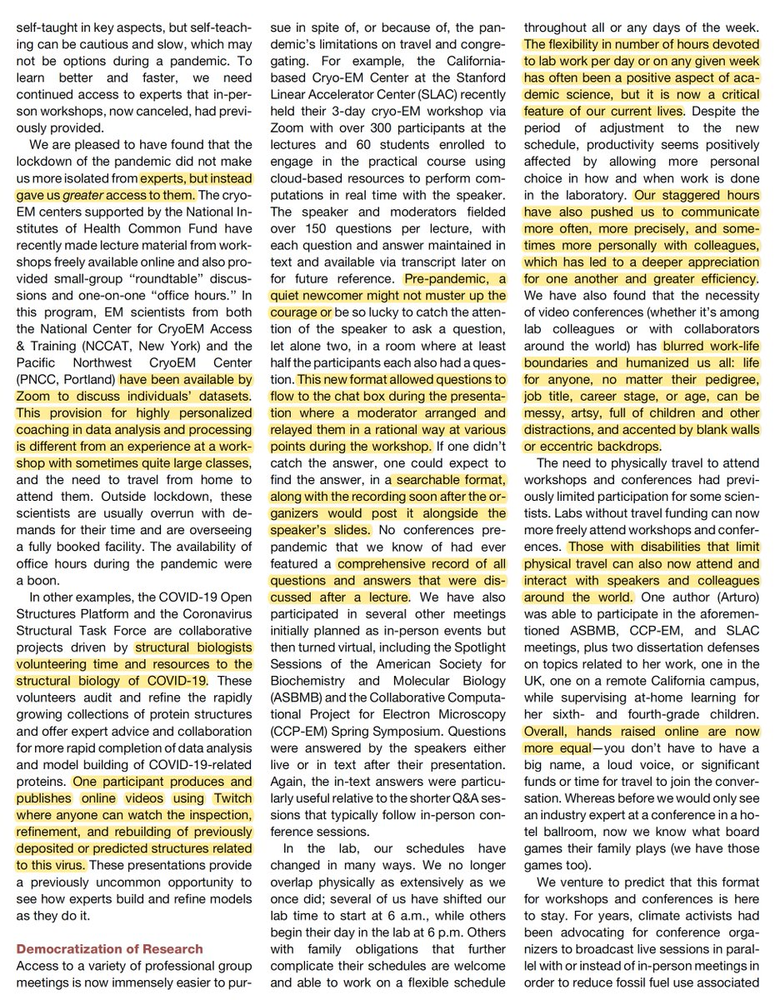
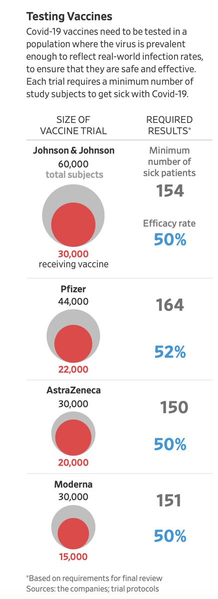

+++
title = "Eric Topol"
date = 2020-10-01
Summary = "Tweets by Eric Topol"
tags = ["Twitter"]
category = "Twitter"
+++

---

<a href="https://twitter.com/erictopol/status/1311456422245265408" target="_blank" rel="noreferer nofollow">00:02 UCT</a>

New @PNASNews on the race and obstacle to get a rapid home covid infectious test
https://www.pnas.org/content/early/2020/09/29/2019062117 
@E25Bio has been sitting since April with a home test ready to go! 
w/ @michaelmina_lab @DanLarremore @mammothbiosci 
https://twitter.com/EricTopol/status/1311410741203795970 

<a href="./EjM5lVBVkAAchdV.jpg"  ></img></a><a href="./EjM6c31VgAA9Kuz.jpg"  ></img></a><a href="./EjM6c31VkAAfXeK.jpg"  ></img></a>

---

<a href="https://twitter.com/erictopol/status/1311502356895260675" target="_blank" rel="noreferer nofollow">03:05 UCT</a>

How much can he take?
https://www.nytimes.com/2020/09/30/health/covid-cruise-ships.html?searchResultPosition=2 on @CDCDirector
by the man who is "the largest driver of the #infodemic"
https://www.nytimes.com/2020/09/30/us/politics/trump-coronavirus-misinformation.html?smid=tw-share
on @Cornell study by @Sarah_Evanega @ScienceAlly and colleagues
both @BySheilaKaplan 

<a href="./EjNh8NHU8AAUgR5.png"  ></img></a>

---

<a href="https://twitter.com/erictopol/status/1311510035214659585" target="_blank" rel="noreferer nofollow">03:35 UCT</a>

@chitguppi @michaelmina_lab @MoHFW_INDIA @apoorva_nyc @DrSubhasree @gummibear737 @VirusWhisperer @Mundra08 @AnantBhan @RPrasad12 @spkalantri good highlights😉 https://twitter.com/EricTopol/status/1311410741203795970
and good thread summary

---

<a href="https://twitter.com/erictopol/status/1311511750911553536" target="_blank" rel="noreferer nofollow">03:42 UCT</a>

@steveusdin1 @DrPaulOffit @V2019N Not what he told me in our recent @Medscape interview
https://www.medscape.com/viewarticle/936937
Turns out moderate to severe disease is the secondary, not primary endpoint of the trials, as we learned when the protocols were released. 

<a href="./EjNsSB6UYAAeA6V.png"  ></img></a>

---

<a href="https://twitter.com/erictopol/status/1311661291753201665" target="_blank" rel="noreferer nofollow">13:36 UCT</a>

"Truth may be difficult to know, but the scientific process is our best path to knowing it."
Editorial @NEJM https://www.nejm.org/doi/full/10.1056/NEJMe2030687?query=featured_home 

<a href="./EjP0NmvUYAEY4JV.jpg"  ></img></a><a href="./EjP0PhWVoAI2uUF.jpg"  ></img></a>

---

<a href="https://twitter.com/erictopol/status/1311664923282268169" target="_blank" rel="noreferer nofollow">13:51 UCT</a>

The pandemic in the US exposed its profound inequities in #healthcare, the only developed country which does not provide this to all as a human right. Now, with a "Ruth-less" Supreme Court, things could get even worse
https://www.nejm.org/doi/full/10.1056/NEJMp2030358?query=featured_secondary @NEJM 

<a href="./EjP2C_oVcAAtTlY.jpg"  ></img></a>

---

<a href="https://twitter.com/erictopol/status/1311685130499444737" target="_blank" rel="noreferer nofollow">15:11 UCT</a>

There’s been a lot of joking about getting a nasopharyngeal swab can be like a brain biopsy. Well, that actually happened https://jamanetwork.com/journals/jamaotolaryngology/article-abstract/2771362 @JAMAOto 

<a href="./EjQKq2dU0AAiHpO.jpg"  ></img></a>

---

<a href="https://twitter.com/erictopol/status/1311697244815388677" target="_blank" rel="noreferer nofollow">15:59 UCT</a>

The patient who experienced this extraordinarily rare complication (only 1 reported in hundreds of millions of NP swab tests performed) had an undiagnosed skull base defect. 

<a href="./EjQVWmBVoAEL2l_.jpg"  ></img></a>

---

<a href="https://twitter.com/erictopol/status/1311700258762571776" target="_blank" rel="noreferer nofollow">16:11 UCT</a>

Our immune response to #SARSCoV2 has generally been underestimated 
https://www.cell.com/cell/fulltext/S0092-8674(20)31154-5
Summary of recent studies that support the redundancy and diversity of our immune system; a potent CD8+ and CD4+  T cell response can occur even in people without symptoms
@CellCellPress 

<a href="./EjQXvUeUcAIuLZ5.jpg"  ></img></a>

---

<a href="https://twitter.com/erictopol/status/1311708637526540288" target="_blank" rel="noreferer nofollow">16:44 UCT</a>

@legalnomads @naomiduguid Would be interested to know if there are other cases of CSF leak. I haven't seen any reported I the literature.

---

<a href="https://twitter.com/erictopol/status/1311726451276705793" target="_blank" rel="noreferer nofollow">17:55 UCT</a>

The pandemic, sleep disruption, and nightmares
https://www.frontiersin.org/articles/10.3389/fpsyg.2020.573961/full Analysis of data from &gt;4,000 individuals in Finland using computational linguistics, #AI by @anu_katriina and colleagues @helsinkiuni @UnivHelsinkiCS 

<a href="./EjQi2mZUYAAGhqz.jpg"  ></img></a>

---

<a href="https://twitter.com/erictopol/status/1311728621266976768" target="_blank" rel="noreferer nofollow">18:04 UCT</a>

Practical travel tips for safety in the covid era
https://www.consumerreports.org/travel/covid-19-travel-toolkit-coronavirus-pandemic/ @ConsumerReports 
https://jamanetwork.com/journals/jama/fullarticle/2771435?guestAccessKey=cbf95e03-3def-43e8-952b-cde12b6a51c5 @JAMA_current 

<a href="./EjQyALHVoAAowQ8.jpg"  ></img></a><a href="./EjQyI-xUYAANPkH.jpg"  ></img></a>

---

<a href="https://twitter.com/erictopol/status/1311729799216287744" target="_blank" rel="noreferer nofollow">18:08 UCT</a>

Missing words and sentiment during the American pandemic
by @hholdenthorp 
@ScienceMagazine 
https://science.sciencemag.org/content/early/2020/09/30/science.abf0577 

<a href="./EjQzMNnUcAAiovp.jpg"  ></img></a>

---

<a href="https://twitter.com/erictopol/status/1311731209135747074" target="_blank" rel="noreferer nofollow">18:14 UCT</a>

@hholdenthorp @juliettekayyem @NickKristof @FrankBruni @shustweet Thanks so much, Holden, for standing up and representing the science and biomedical community. 🙏🙏

---

<a href="https://twitter.com/erictopol/status/1311739108201439232" target="_blank" rel="noreferer nofollow">18:45 UCT</a>

How science and the lives of scientists have changed, democratized, and benefited during the pandemic lockdown
https://www.cell.com/cell/fulltext/S0092-8674(20)31224-1?rss=yes @CellCellPress Uplifting, by @moonlighterturo @EOSaphire @ljiresearch 

<a href="./EjQ7OVPVoAAye2b.jpg"  ></img></a><a href="./EjQ7P0dU4AE6xk4.jpg"  ></img></a><a href="./EjQ7RX1UwAUZ2B8.jpg"  ></img></a>

---

<a href="https://twitter.com/erictopol/status/1311740578439155719" target="_blank" rel="noreferer nofollow">18:51 UCT</a>

@erikleejohnson @zeynep Agree!
https://twitter.com/EricTopol/status/1266758299824697345

---

<a href="https://twitter.com/erictopol/status/1311750349376516096" target="_blank" rel="noreferer nofollow">19:30 UCT</a>

RT @hholdenthorp: Extraordinary reporting on @US_FDA by @cpiller. @EricTopol https://twitter.com/cpiller/status/1311736067263922176

---

<a href="https://twitter.com/erictopol/status/1311753675862204416" target="_blank" rel="noreferer nofollow">19:43 UCT</a>

More on loss of smell, not only localizing #SARSCoV2 spread as shown here, but also now correlated with seropositivity, even higher when combined w/ loss of taste
https://journals.plos.org/plosmedicine/article?id=10.1371/journal.pmed.1003358 @PLOSMedicine  https://twitter.com/_cingraham/status/1311497416399556609

<a href="./EjRIzfOVgAAdsPV.png"  ></img></a>

---

<a href="https://twitter.com/erictopol/status/1311757747738693632" target="_blank" rel="noreferer nofollow">19:59 UCT</a>

A very thoughtful piece on the vaccines—what defines success—the endpoints, and whether they can be compared. https://www.wired.com/story/what-does-it-mean-if-a-vaccine-is-successful/ by @jetjocko @WIRED @WIREDScience w/ @betzhallo @nataliexdean @peterbachmd

---

<a href="https://twitter.com/erictopol/status/1311774204652523520" target="_blank" rel="noreferer nofollow">21:05 UCT</a>

More on this topic by @JaredSHopkins 
https://www.wsj.com/articles/covid-19-vaccine-trials-need-only-a-fraction-of-people-to-get-sick-11601550013?mod=hp_lead_pos6
The 150-164 events that can pave the way for millions of people to get vaccinated......(and even less is a trial is stopped early for efficacy) 

<a href="./EjRboaiVoAIwoVU.jpg"  ></img></a>

---

<a href="https://twitter.com/erictopol/status/1311790002116853760" target="_blank" rel="noreferer nofollow">22:08 UCT</a>

On the home, rapid virus tests, lower (anterior) nose swab will be the main route to start (not saliva). Good status review here of some of the leading edge companies. 
Just need a rapid regulatory path to get this going
https://www.nytimes.com/2020/10/01/health/coronavirus-saliva-tests.html by @KatherineJWu

---

<a href="https://twitter.com/erictopol/status/1311802325015515136" target="_blank" rel="noreferer nofollow">22:57 UCT</a>

A wonderful profile of @devisridhar, a global guiding force  for the pandemic. @TheLancet https://www.thelancet.com/journals/lancet/article/PIIS0140-6736(20)32031-6/fulltext
No wonder Scotland has done so well.
The youngest Rhodes Scholar at age 18! @rhodes_trust should be very proud. 

<a href="./EjR1CvnU8AAfgro.jpg"  ></img></a>

---

<a href="https://twitter.com/erictopol/status/1311808217941340160" target="_blank" rel="noreferer nofollow">23:20 UCT</a>

RT @scrippsresearch: What happens when you try to develop a vaccine for a brand new disease at “warp speed”? @EricTopol joined @BillNye on…

---

<a href="https://twitter.com/erictopol/status/1311812058346778624" target="_blank" rel="noreferer nofollow">23:35 UCT</a>

It's hard to make neurodegeneration aesthetic. But somehow @simonprades did. A @ScienceMagazine special issue covers genetics, sleep, glymphatics and more 
https://science.sciencemag.org/content/370/6512/48 

<a href="./EjR98ijU8AAcXae.jpg"  ></img></a><a href="./EjR99tAVoAEd3Qr.jpg"  ></img></a><a href="./EjR9_fZVkAUIQho.jpg"  ></img></a><a href="./EjR-CVgUYAcR1X7.jpg"  ></img></a>